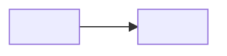

# Workflow: Codebase Knowledge

**Announce at start:** "Activating `workflow-codebase-knowledge` to present a structured knowledge document."

## When to invoke

- Onboarding to an unfamiliar codebase: "walk me through this repo."
- Knowledge-handoff request: "give the incoming engineer a mental model of the service."
- Reviewer context-gathering: "what are the public API surfaces before I start the PR review?"
- Architecture exploration: "show me the module boundaries and their relationships."

## When NOT to invoke

- **Defect detection or ranked findings** → use `swe-workbench:workflow-codebase-audit` (cold-start multi-axis sweep with reasoning chains and severity ranking).
- **Generating new prose documentation** (READMEs, ADRs, ARCHITECTURE files) → use `/swe-workbench:document` which delegates to the `tech-writer` subagent.
- **Known bug with a repro** → use `/swe-workbench:debug`.
- **PR diff review** → use `/swe-workbench:review`.

## Composition

Read-only sweep — no subagents dispatched. May delegate file discovery to `Explore` agents in parallel for breadth when the path scope is wide. Never writes to disk.

## Path argument

An optional path narrows the scope: `/swe-workbench:codebase-knowledge src/` focuses all phases on `src/` and its descendants. Without a path, the sweep covers the entire repo root.

A token is treated as a path if it contains `/`, starts with `.`, or matches an existing directory in the repo; otherwise the entire argument string is treated as natural-language context with no path scoping.

## Phases

### Phase 1 — Scope & entry-points

Identify the repo type (library, service, CLI, monorepo) and locate entry-points:
- Executable entry-points: `main.*`, `index.*`, `__main__.py`, `cmd/`, `bin/`.
- Build manifests: `package.json`, `Cargo.toml`, `go.mod`, `pyproject.toml`, `pom.xml`.
- Public interface declarations: exported symbols, `__init__.py`, `mod.rs`, `index.ts`.

Record the path argument (or `.` if absent) and apply it as a filter to all subsequent phases.

### Phase 2 — Module map

Walk the top-level directory structure. For each module or package:
- Name and purpose (one line — inferred from code, not invented).
- Dependencies on other modules in this repo (imports, `use`, `require`).
- Notable size signals (number of files, presence of sub-packages).

Stop at 2 levels of depth unless the path argument targets a subtree.

### Phase 3 — Public API surfaces

Identify the externally-facing interface of the codebase:
- HTTP/RPC routes: router registrations, controller annotations, protobuf service definitions.
- Exported functions/types in library packages.
- CLI commands and flags.
- Event schemas: topics, message contracts.

List only the surface, not the implementation detail.

### Phase 4 — Patterns & conventions

Read 3–5 representative files per module to identify recurring patterns:
- Error handling style (exceptions, Result types, error codes).
- Testing conventions (framework, fixture style, what is and is not mocked).
- Naming and file-organisation conventions.
- Dependency injection or service-locator patterns.
- Any notable abstractions that appear across multiple modules.

### Phase 5 — Render

Produce the knowledge document using the rendering template below. Omit any section where there is genuinely nothing to say — do not pad. Apply the diagram signal-to-noise rule before including any Mermaid block.

## Rendering template

````markdown
## Codebase Knowledge — <repo> — <date>

### Overview

<2–4 sentences: what this codebase does, its type (service/library/CLI/monorepo), primary language(s), and rough size signal.>

### Module map

| Module | Purpose | Depends on |
|--------|---------|------------|
| `<name>` | <one-line purpose> | `<dep>`, `<dep>` |

### Architecture diagram

<!-- Include only when the module graph has meaningful topology (see Diagram guidelines). -->



### Public API surfaces

| Surface | Kind | Location |
|---------|------|----------|
| `<name>` | HTTP route / exported fn / CLI cmd / event topic | `<file:line>` |

### Patterns & conventions

- **Error handling:** <style>
- **Testing:** <framework, fixture conventions, mock boundary>
- **Naming:** <conventions observed>
- **Notable abstractions:** <list or "none observed">
````

## Diagram guidelines

Include a Mermaid diagram only when it adds information that the module map table cannot convey.

| Situation | Rule |
|-----------|------|
| ≤5 modules, flat structure | Skip — the module map table is sufficient |
| Meaningful cross-module dependency edges | Use `flowchart LR` |
| Request/response lifecycle across layers | Use `sequenceDiagram` |
| Hierarchical package nesting | Use `graph TD` |
| Flat list of peer modules (no edge topology) | Skip — a diagram would just redraw the table |

Cap at **1 diagram per output section**. Omit if the diagram would have fewer than 3 nodes.

Preferred formats: `flowchart LR`, `sequenceDiagram`, `graph TD`.

## Absolute rules

- **Read-only.** Never invoke `Edit`, `Write`, or any shell command that modifies the filesystem.
- **Never invent structure.** Every module, API, and pattern listed must be traceable to actual code. If a module's purpose is unclear, say so — do not guess.
- **Cap diagrams.** At most 1 diagram per output section; omit when the signal-to-noise rule says Skip.
- **Omit empty sections.** If Phase 3 yields no public API surface, omit the Public API surfaces section entirely. Silence is correct; padding misleads.
- **No defect reporting.** This skill presents structure; it does not rank findings, assign severity, or suggest fixes. Route those needs to `workflow-codebase-audit`.
